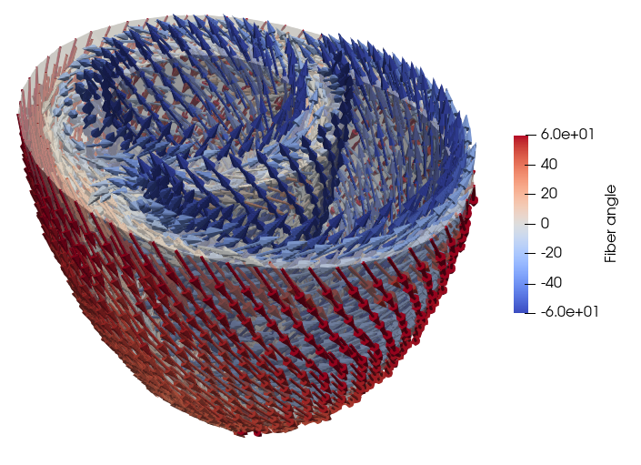

<p align="center">
  
</p>


# Laplace-Dirichlet Rule-Based (LDRB) algorithm for assigning myocardial fiber orientations


A software for assigning myocardial fiber orientations based on the Laplace Dirichlet Ruled-Based algorithm based on FEniCSx.

> Bayer, J.D., Blake, R.C., Plank, G. and Trayanova, N.A., 2012.
> A novel rule-based algorithm for assigning myocardial fiber orientation
>to computational heart models. Annals of biomedical engineering, 40(10),
pp.2243-2254.(https://www.ncbi.nlm.nih.gov/pmc/articles/PMC3518842/)


## Getting started
For example if you have a bi-ventricular geometry (e.g from [`cardiac-geometries`](https://github.com/ComputationalPhysiology/cardiac-geometriesx)), you can generate fibers as follows
```python
import cardiac_geometries
import ldrb
import dolfinx

# Generate an idealized BiV geometry
geo = cardiac_geometries.mesh.biv_ellipsoid(outdir=geodir)
# Generate fibers with 60/-60 fibers angles on the endo- and epicardium
system = ldrb.dolfinx_ldrb(mesh=geo.mesh, ffun=geo.ffun, markers=geo.markers, alpha_endo_lv=60, alpha_epi_lv=-60, beta_endo_lv=0, beta_epi_lv=0, fiber_space="P_2")
# Visualize fibers in Paraview
with dolfinx.io.VTXWriter(
    geo.mesh.comm, outdir / f"microstructure-viz.bp", [system.f0, system.s0, system.n0], engine="BP4"
) as vtx:
    vtx.write(0.0)
```
If you now open the file `microstructure-viz.bp` in Paraview (using the ADIOS2VTXReader), select Glyph and choose `f0` as orientation array you can see the fiber orientations similar to the following figure (here I have also added a Calculator to compute the fiber angle)


Note that you can achieve the the same results using the command line interface
```
ldrb mesh.xdmf --markers-file markers.json --fiber-space P_2 --alpha-endo-lv 60 --alpha-epi-lv -60 --beta-endo-lv 0 --beta-epi-lv 0
```
Note that if you don't specify a different angle for the RV or Septum, then the same angle as the LV will be used.

## Installation

## pip
```
python3 -m pip install fenicsx-ldrb
```

## Docker
To pull the latest docker image you can do
```
docker pull ghcr.io/finsberg/fenicsx-ldrb:main
```
or choose a specific version e.g
```
docker pull ghcr.io/finsberg/fenicsx-ldrb:v0.1.4
```
Note that you can also run the cli directly using docker e.g
```
docker run --rm -v $PWD:/home/shared -w /home/shared -it ghcr.io/finsberg/fenicsx-ldrb ldrb --help
```

# Documentation
See https://finsberg.github.io/fenicsx-ldrb


# License
MIT

# Contributors
Henrik Finsberg (henriknf@simula.no)
